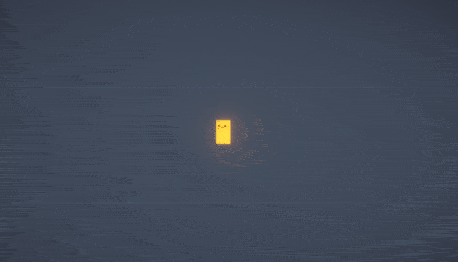
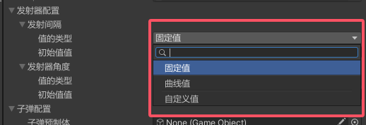
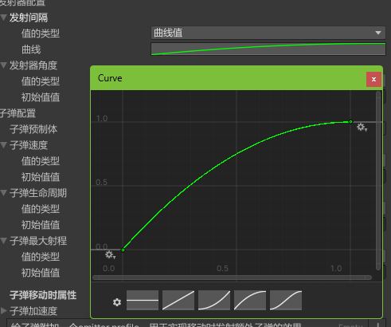
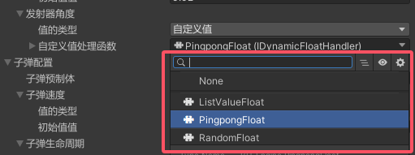
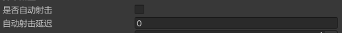
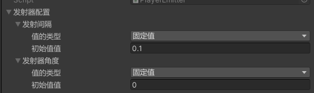
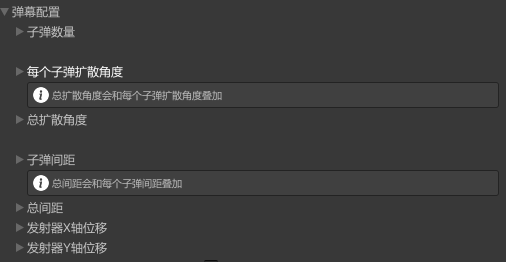
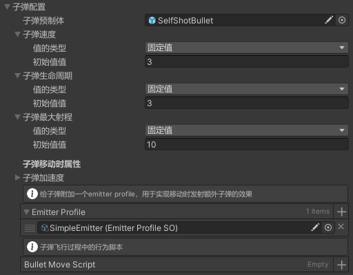
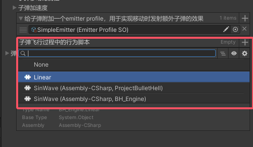
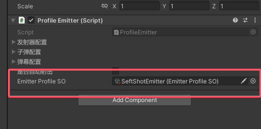

# BH_Engine

- [BH\_Engine](#bh_engine)
- [效果展示](#效果展示)
- [简介](#简介)
- [快速开始](#快速开始)
- [核心概念](#核心概念)
  - [动态值 DynamicValue](#动态值-dynamicvalue)
    - [自定义值](#自定义值)
  - [发射器 Emitter](#发射器-emitter)
  - [基础发射器 BaseEmitter](#基础发射器-baseemitter)
    - [发射器配置](#发射器配置)
    - [弹幕配置](#弹幕配置)
    - [子弹配置](#子弹配置)
      - [衍生弹幕](#衍生弹幕)
      - [子弹行为脚本 BulletMoveScript](#子弹行为脚本-bulletmovescript)
  - [可配置发射器 ProfileEmitter](#可配置发射器-profileemitter)
- [其他功能](#其他功能)
  - [主动射击](#主动射击)
  - [使用对象池管理子弹](#使用对象池管理子弹)

# 效果展示




# 简介


> 因为unity自身对SerializeReference的支持不够，BH_Engine运行时必须依赖[Odin Inspector](https://assetstore.unity.com/packages/tools/utilities/odin-inspector-and-serializer-89041)。

BH_Engine是一个2d弹幕游戏引擎，它的出现主要是为了解决其他大多数弹幕引擎无法在游戏运行后实时更改弹幕样式的问题（如以撒的结合中，获得多个道具后可以叠加它们对弹幕的影响）。

BH_Engine还具有极高的自由度，所有与弹幕相关的属性都支持自定义，同时还具有发射衍生弹幕、自定义子弹运行轨迹等功能。

> 如果你的游戏因为大量碰撞导致卡顿，可以参考下我开发的高性能2d碰撞引擎[WorldUnitCollision2DSystem](https://github.com/fuxiang123/WorldUnitCollision2DSystem)。

# 快速开始

参考Example文件中的例子，或遵循以下步骤。

1. 在`BH_Engine -> Prefab`文件夹下，将`BH_EngineManager`预制体复制到你的场景中。
2. 创建一个游戏物体，并在它下面添加一个子物体作为发射器。在子物体上添加BaseEmitter组件，并勾选自动射击。
3. 创建一个GameObject作为子弹，在该物体上添加BulletBehaviour组件。
4. 将子弹拖入到`BaseEmitter -> 子弹配置 -> 子弹预制体`参数中。
4. 运行游戏，并修改BaseEmitter中的参数，观察弹幕是如何随之变化的。

# 核心概念

## 动态值 DynamicValue

动态值是BH_Engine实现高度自定义化的核心。BH_Engin发射器的每一项参数都可以通过动态值进行配置。



如图所示，动态值有三种类型：<b> 固定值、曲线值和自定义值 </b> 。

顾名思义，`固定值`就是一直保持不变的值。`曲线值`则利用了unity本身的AnimationCurve功能，可以通过曲线调整随时间变化的值（如下图所示），详情可以参考[Unity文档 (编辑曲线)](https://docs.unity3d.com/cn/2023.2/Manual/EditingCurves.html)。



### 自定义值

如果你的弹幕行为特别复杂，可以通过`自定义值`调整。`自定义值`需要你自己编写一个脚本，实现`IDynamicFloatHandler`或者 `IDynamicIntHandler`接口。

> 使用`IDynamicFloatHandler`还是`IDynamicIntHandler`视发射器参数的类型决定，如`发射间隔`参数是float类型，就应该实现`IDynamicFloatHandler`脚本；而`子弹个数`参数是int类型，就应该实现IDynamicIntHandler接口。

一个用随机数作为自定义值例子如下（你可以在`Scripts\Core\DynamicValues\DynamicValueHandlers`文件夹下找到更多例子）：

```c#
using System;
using Sirenix.OdinInspector;
using UnityEngine;

namespace BH_Engine
{
    [Serializable]
    public class RandomFloat : IDynamicFloatHandler
    {
        [LabelText("最大值"), SerializeField]
        private float min;
        [LabelText(text: "最小值"), SerializeField]
        private float max;
        // x代表上一次的值
        public float Calculate(float x)
        {
            // 通过返回值更新动态值
            return UnityEngine.Random.Range(min, max);
        }
    }

    [Serializable]
    public class RandomInt : IDynamicIntHandler
    {
        [LabelText("最大值"), SerializeField]
        private int min;
        [LabelText(text: "最小值"), SerializeField]
        private int max;
        // x参数上一次的值
        public int Calculate(int x)
        {
            // 通过返回值更新动态值
            return UnityEngine.Random.Range(min, max);
        }
    }
}
```

当你实现了对应接口，就可以将其拖入到`自定义值处理函数`中（或者点击右边的下拉剪头，通过Odin提供的搜索功能找到你的脚本）。这样该参数就会使用`Calculate`函数中的返回值作为自己的值使用。



## 发射器 Emitter 

发射器为控制子弹发射的组件，它决定了子弹生成那一瞬间的位置/角度/加速度等参数。通过调整里面的参数，可以实现复杂的弹幕效果。

即便在游戏运行后，你仍然可以通过脚本对Emitter的参数进行直接修改（以修改`动态值 DynamicValue`的方式），这些修改会直观地反映到弹幕上。

BH_Engine提供了两种发射器，BaseEmitter（基础发射器）和ProfileEmitter（可配置发射器）。

## 基础发射器 BaseEmitter

基础发射器拥有自动射击和手动射击两种模式，可以满足大多数弹幕需求。通过勾选或取消`是否自动射击`选项来切换自动射击。



除此之外，BaseEmitter发射器参数有着三大模块，分别是发射器配置，子弹配置，弹幕配置。

### 发射器配置



发射器配置主要控制发射器的一些基本参数，如发射间隔/发射器角度等。

> 因为一些发射器参数（如发射器角度和位移）会改变物体的Position，为避免对视觉产生影响，BH_Engine强制要求在一个单独的子物体上放置发射器。如果`Emitter`没有父物体，这些参数不会生效。

### 弹幕配置



弹幕配置主要控制弹幕形状相关的参数。如一次发射生成的子弹数量、子弹之间的扩散角度、子弹之间的间距等。

### 子弹配置



子弹配置主要控制单个子弹的参数。如子弹速度、子弹射程、加速度等。它需要传入一个prefab，来控制生成的子弹实例。

#### 衍生弹幕

你还可以给子弹附加一个emitter profile，这样子弹在飞行时，其本身也会被视为一个发射器，从而衍生出更复杂的弹幕效果。

但注意不要将当前正在配置的emitter profile拖入到子弹配置中，否则会因为递归导致无止境地发射。

嵌套弹幕产生的子弹数量是极为恐怖的，因此不建议嵌套太多层的emitter profile，除非你想折磨自己电脑的CPU。

#### 子弹行为脚本 BulletMoveScript

发射的子弹默认直线行驶，你可以传入一个脚本来控制子弹的飞行轨迹。该脚本会覆盖子弹的默认飞行逻辑。

该脚本需要实现`IBulletMoveScript`脚本，同时它会在每个`FixedUpdate`调用一次。一个让子弹以正弦波移动的例子如下(你可以在`Scripts\Core\Configs\BulletMoveScript`文件夹下找到它)：

```c#
[LabelText("正弦波移动")]
// IBulletMoveScript会在每个FixedUpdate调用一次
public class SinWave : IBulletMoveScript
{
    [LabelText("振幅，波的高度")]
    public float amplitude = 2f; // 正弦波振幅
    [LabelText("频率，波的宽度")]
    public float frequency = 2f; // 正弦波频率
    // bulletFinalConfig为子弹配置，bulletBehaviour为控制子弹行为的组件
    public void UpdateBulletMove(BulletFinalConfig bulletFinalConfig, BulletBehaviour bulletBehaviour)
    {
        // 在bulletBehaviour中获取当前子弹的飞行时间
        float time = bulletBehaviour.currentTime;
        float acceleration = bulletFinalConfig.acceleration;
        // 综合子弹加速度和时间，算出当前子弹速度
        float speed = bulletFinalConfig.speed + acceleration * time;
        // 计算正弦波相关参数
        var sine = amplitude * Mathf.Sin(frequency * time * speed);
        var direction = bulletBehaviour.direction;
        var spwanPosition = bulletBehaviour.spwanPosition;
        // 定义一条垂直的轴，在垂直轴上施加正弦函数
        var crossDirection = new Vector3(direction.y, -direction.x);
        // 通过修改position，将子弹移动到下一帧的位置
        bulletBehaviour.transform.position = spwanPosition + (direction * speed * time) + (crossDirection * sine);
    }
}
```
当你实现了对应接口，就可以将其拖入到`子弹飞行过程中的行为脚本`中（或者点击右边的`+`号，通过Odin提供的搜索功能找到你的脚本）。



## 可配置发射器 ProfileEmitter

`ProfileEmitter`为`BaseEmitter`的子类，它和`BaseEmitter`基本相同，唯一区别是可以传入`EmitterProfileSO`来预先定义弹幕。

`EmitterProfileSO`本质是一个`ScriptableObject`，通过在`Project窗口右键 -> BH_Engine -> EmitterProfileSO`进行创建。它的参数和BaseEmitter完全一致。

将`EmitterProfileSO`拖入到`ProfileEmitter`组件中的`Emitter Profile SO`参数中，游戏运行后，`ProfileEmitter`会自动使用`EmitterProfileSO`中的配置。



# 其他功能

如果你有更多需求或问题，可以在issue中提出。

## 主动射击

参考`Example/Scripts/PlayerShot.cs`中的代码，`Emitter`提供了三个方法`StartShoot`,`PauseShoot`,`StopShoot`三个方法，来控制射击行为。

* 使用`StartShoot`会打开自动射击。

* 使用`PauseShoot`会暂停自动射击，但保留上一次的动态值（有的动态值会依赖上一次的值进行变化）。

* 使用`StopShoot`会停止自动射击，同时重置所有的动态值。

## 使用对象池管理子弹

`BaseEmitter`内部有`GetBullet`和`ReleaseBullet`两个方法，分别对应创建和销毁子弹的过程。默认情况下，BH_Engine使用`Instantiate`创建子弹，使用`Destroy`销毁子弹。

你可以通过继承`BaseEmitter`或`ProfileEmitter`，并重写（override）这两个方法，来自己控制子弹的创建和销毁。一个使用对象池的例子如下：

```c#
public class PlayerEmitter : ProfileEmitter
{
    // 参数中的prefab，代表在当前Emitter子弹配置中的prefab
    protected override GameObject GetBullet(GameObject prefab)
    {
        var bullet = BulletPoolManager.Instance.GetPlayerBullet();
        // 做一些其他操作，如添加组件、拷贝视觉效果等
        return bullet;
    }

    protected override void ReleaseBullet(BulletBehaviour bullet)
    {
        BulletPoolManager.Instance.ReleasePlayerBullet(bullet.gameObject);
    }
}
```